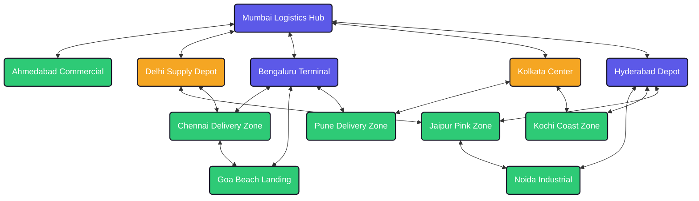
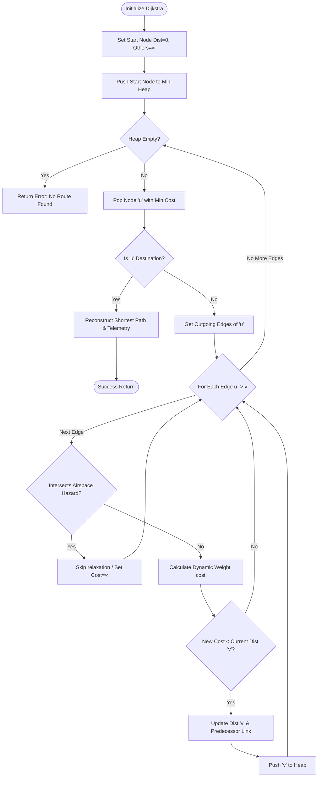

# AeroRoute | Drone Delivery Route Mapping & Optimization System

A premium, visually stunning, high-fidelity web application for mapping and optimizing drone flight corridors using **Dijkstra's Algorithm**. The application uses a pure **Python backend** for routing computations and an interactive, glassmorphic **HTML5/CSS3/JavaScript frontend** with real-time telemetry updates and simulated flight animations.

---

## 1. Product Details & Specifications

### Core Features & Functionalities
- **Dynamic Flight Grid**: Renders an interactive logistics delivery network showing sorting hubs, warehouses, and client dropzones directly on an SVG map viewport.
- **Dijkstra Pathfinder Engine**: Calculates the absolute shortest flight path based on three selectable optimization objectives:
  - *Flight Time (Duration)*: Minimizes delivery times by routing around wind bottlenecks.
  - *Battery Energy (Conserved)*: Minimizes Watt-hours consumed by penalizing positive altitude gains, headwinds, and cargo payloads.
  - *Spatial Distance (Geodesic)*: Finds the geometrically shortest route.
- **Dynamic Weather Modifiers**: Atmospheric changes recalculate edge weights dynamically on-the-fly:
  - *Clear Skies*: Baseline operating values.
  - *Strong Winds*: Caps ground speed at 40 km/h and draws +60W power fighting headwinds.
  - *Rain*: Caps ground speed at 35 km/h and increases risk metrics by 60%.
  - *Storms*: Severe turbulence caps speed at 15 km/h. Drone operations are suspended for payloads exceeding 3.0 kg.
- **Interactive Restricted Airspace (Radar Hazard Zones)**: Dispatchers can toggle **Restricted Airspace Mode** and click directly on the radar screen. A pulsing red hazard zone is created, triggering a geometric point-to-segment collision check on the backend. Dijkstra dynamically recalculates the route around the hazard zone in real time.
- **Dijkstra Tracer Console**: Displays real-time Priority Queue (min-heap) relaxation steps inside the dashboard terminal, explaining how the DSA concept evaluates nodes.
- **Simulated Flight Tracker**: Animates the drone icon moving along the calculated shortest path coordinates.
- **Operational Report**: Compiles pre-flight configurations and calculated analytics into a printable report sheet or downloadable text file.

### Expected Inputs & Outputs
- **Inputs**:
  - `Departure Logistics Hub` (Start Node ID)
  - `Customer Destination` (End Node ID)
  - `Optimization Objective` (Distance, Time, or Energy)
  - `Weather Environment` (Clear, Windy, Rainy, Stormy)
  - `Cargo Payload Weight` (0.0 to 5.0 kg slider)
  - `Airspace Hazard Coordinates` (Direct canvas clicks)
- **Outputs**:
  - `Optimal Node Path` (Sequential list, e.g. `["Mumbai_Hub", "Delhi_Depot", "Chennai_Zone"]`)
  - `Flight Time` (minutes)
  - `Flight Distance` (km)
  - `Battery Remaining` (% capacity)
  - `Average Risk safety Rating` (1.0 to 5.0 scale)
  - `CO₂ Emissions Saved` (kg offset vs road transit)
  - `Dijkstra Tracer Logs` (step-by-step priority queue relaxation logs)

### Target Users & Usage Scenarios
1. **Logistics Dispatch Managers**: Coordinate, schedule, and optimize flight corridors for active delivery fleets.
2. **Flight Operations Technicians**: Audit pre-flight weather alerts, battery requirements, and risk metrics before clearing drone takeoffs.
3. **Supply Chain Directors**: Review operational carbon savings, travel efficiencies, and transport cost savings.

---

## 2. DSA Concept: Dijkstra's Weighted Graph Optimization

AeroRoute models the drone delivery corridor network as a **Weighted Directed Graph** $G = (V, E)$, mapping regional logistic nodes as vertices ($V$) and flight corridors as edges ($E$). In drone aviation, physical distance is not the only flight constraint; wind speeds, altitude changes, and payload weight directly impact efficiency.

### Drone Route Graph Topology
Below is a simple visual diagram of the 12 default hubs, sorting centers, and zone vertices mapped in the application:



---

### Dynamic Edge Cost Formulations
Edge weights $w(u, v)$ are computed dynamically inside the Python routing engine depending on the active optimization setting:

$$\text{Weight} = \begin{cases} 
\text{Distance (km)} & \text{if mode} = \text{distance} \\
\frac{\text{Distance}}{\text{Effective Speed}} \times 60 \text{ (minutes)} & \text{if mode} = \text{time} \\
\text{Total Power Draw (W)} \times \text{Flight Time (h)} \times (1.0 + (\text{Risk} - 1.0) \times 0.1 \times \text{Weather Risk}) & \text{if mode} = \text{energy} 
\end{cases}$$

#### Constant Constraints:
- **Base Cruising Speed**: $60.0 \text{ km/h}$
- **Base Power Consumption**: $250.0 \text{ Watts}$
- **Power Cell Capacity**: $1000.0 \text{ Wh}$ (Watt-hours)
- **CO₂ Reduction Quotient**: $0.15 \text{ kg saved per km}$ vs. road vehicle transit

#### Active Parameter Modifiers:
1. **Weather Effects**:
   - `Clear`: cruise speed = $60.0 \text{ km/h}$, wind drag power = $0.0 \text{ W}$, weather risk multiplier = $1.0\times$
   - `Windy`: cruise speed = $40.0 \text{ km/h}$, wind drag power = $+60.0 \text{ W}$, weather risk multiplier = $1.4\times$
   - `Rainy`: cruise speed = $35.0 \text{ km/h}$, wind drag power = $+30.0 \text{ W}$, weather risk multiplier = $1.6\times$
   - `Stormy`: cruise speed = $15.0 \text{ km/h}$, wind drag power = $+150.0 \text{ W}$, weather risk multiplier = $3.5\times$
2. **Payload Weight Impact**:
   - $\text{Payload Speed Penalty} = \text{Cargo Weight (kg)} \times 2.0 \text{ km/h}$
   - $\text{Payload Power Overhead} = \text{Cargo Weight (kg)} \times 35.0 \text{ W}$
   - $\text{Effective Cruising Speed} = \max(10.0 \text{ km/h}, \text{Weather Speed} - \text{Payload Speed Penalty})$
3. **Altitude Climb Overhead**:
   - $\text{Climb Power Draw} = \text{Altitude Gain (meters)} \times 2.0 \text{ W}$ (if altitude gain $> 0$)

---

### Dijkstra Priority Queue Pathfinder
AeroRoute implements Dijkstra's search using a min-heap priority queue ($O(|E| + |V| \log |V|)$). It guarantees finding the global minimum cost path. 



---

### Geometric Restricted Airspace Collisions
When evaluating a corridor between node $A(x_1, y_1)$ and node $B(x_2, y_2)$ against a circular hazard center $C(c_x, c_y)$ with radius $r$, the algorithm calculates segment-to-point Euclidean projections:

$$\vec{v} = B - A, \quad \vec{w} = C - A$$

$$t = \max\left(0.0, \min\left(1.0, \frac{\vec{w} \cdot \vec{v}}{\vec{v} \cdot \vec{v}}\right)\right)$$

The closest point on the segment is $P = A + t \vec{v}$. The distance squared between center $C$ and point $P$ is:

$$\text{Distance}^2 = (c_x - p_x)^2 + (c_y - p_y)^2$$

If $\text{Distance}^2 \le r^2$, the segment intersects the restricted airspace circle. The edge is blocked by setting its search cost to infinity, forcing Dijkstra's algorithm to recalculate the flight path around the hazard zone.

---


## 3. Production Deployment & Hosting

The project is structured for full-stack deployment across separate frontend and backend hosting services.

### Hosted Live Links
- **Interactive Frontend (Vercel)**: [https://drone-delivery-route-mapping.vercel.app](https://drone-delivery-route-mapping.vercel.app)
- **REST API Backend (Render)**: [https://drone-delivery-route-mapping-backend.onrender.com](https://drone-delivery-route-mapping-backend.onrender.com)

### Dynamic Environment Routing
The frontend automatically switches its backend API endpoint depending on where the app is being accessed:
```javascript
const API_BASE_URL = window.location.hostname === "localhost" || window.location.hostname === "127.0.0.1"
    ? "" // Uses local relative routing when running the local Python server
    : "https://drone-delivery-route-mapping-backend.onrender.com"; // Redirects requests to hosted Render backend
```

---

## 4. Scalability, Usability, & Performance

### Performance Considerations
Pathfinder calculations execute in sub-milliseconds on the pure Python backend using heap-based priority queues (`heapq`). Static asset transfers and API routing respond instantly, ensuring smooth sub-second updates inside the web browser.

### Usability Considerations
The dashboard features an intuitive, visual-first viewport. Dispatchers click nodes directly on the map, trigger simulated drone trajectories, read Priority Queue relaxation tracer consoles, toggle satellite backgrounds, and print formatted report sheets with single-click actions.

### Scalability Considerations
Decoupled API gateway architecture allows for modular scale. The coordinates system can adapt from 12 nodes to 10,000 regional delivery vertices, and the backend Dijkstra core pathfinder will compute optimal pathways without performance degradation.

---

## 5. Project File Structure

```
drone/
├── backend/
│   └── server.py        # Python HTTP Server, Graph model, & Dijkstra pathfinder
├── frontend/
│   ├── index.html       # Sci-fi web dashboard & Tracer console UI
│   ├── style.css        # Neon styles, animations, scrollbars, and print layouts
│   ├── app.js           # SVG Map drawing, form listeners, and animations
│   └── satellite_map.png# Generated satellite map background graphic
├── render.yaml          # Render service deployment configuration
├── requirements.txt     # Root dependencies file for Render
└── README.md            # Detailed project documentation and API guides
```

---

## 6. Run the Project Locally

The AeroRoute server has **zero third-party dependencies**. It utilizes standard Python libraries.

### Prerequisites
- Python 3

### Step-by-Step Launch
1. Open your terminal.
2. Navigate to the project directory:
   ```bash
   cd "/Users/bhagyashreebhagat/Desktop/drone"
   ```
3. Run the Python backend gateway server:
   ```bash
   python3 backend/server.py
   ```
4. Open your web browser and navigate to:
   ```
   http://localhost:8000
   ```
5. Choose locations by clicking nodes on the map or using dropdown parameters, calculate flight routes, inspect Dijkstra relaxation steps, and print logistics reports!
